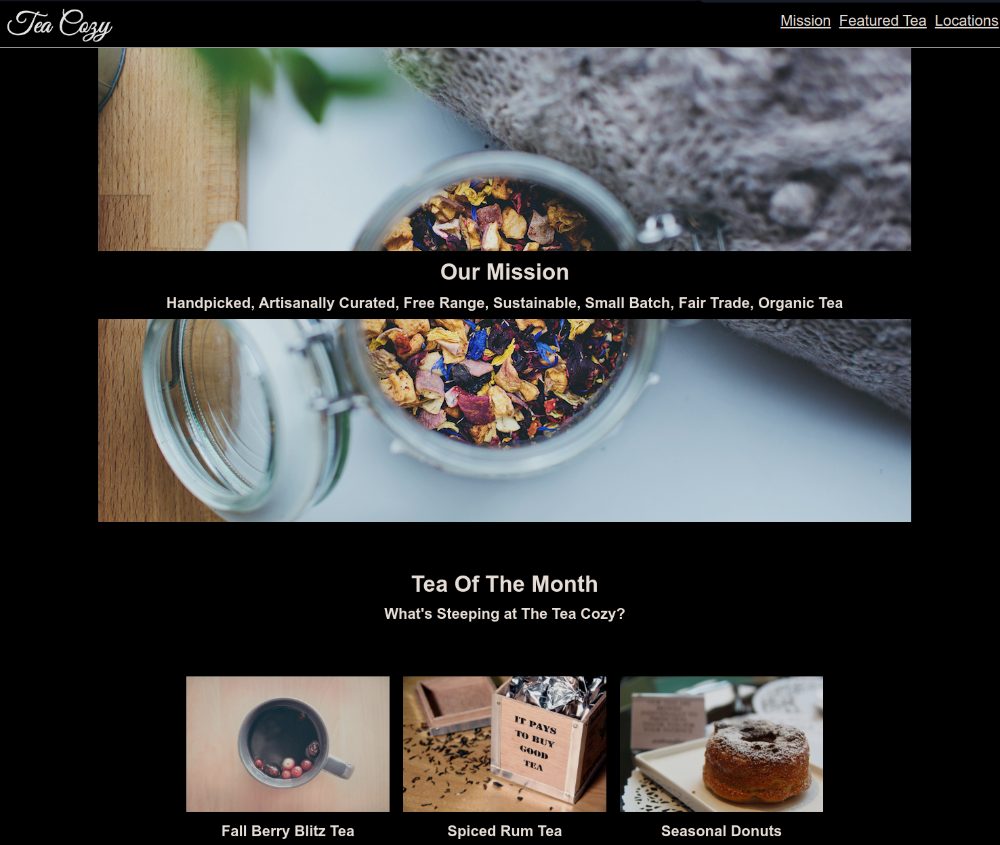

# Tea Cozy

> A simple landing page build with HTML and CSS using Flex.

## Built With

- HTML
- CSS

## Live Demo

[Live Demo Link](https://johndmurphy.github.io/tea-cozy/)

👤 **Author**

- GitHub: [@githubhandle](https://github.com/JohnDMurphy)
- LinkedIn: [LinkedIn](https://www.linkedin.com/in/john-murphy-5020271b5/)

## 🤝 Contributing

Contributions, issues, and feature requests are welcome!

Feel free to check the [issues page](../../issues/).

## Show your support

Give a ⭐️ if you like this project!

## Acknowledgments

- Codecademy

## 📝 License

This project is [MIT](./MIT.md) licensed.
